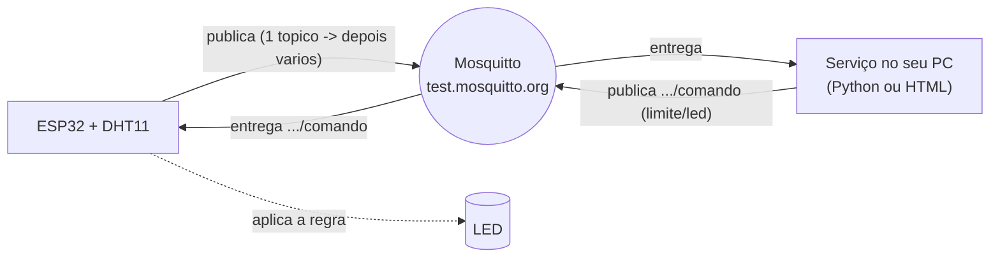

# MQTT com Mosquitto

**Disciplina:** Internet das Coisas (IoT) · Turma AMF 2026-02
**Plataforma:** ESP32 (Arduino) + **Eclipse Mosquitto** (`test.mosquitto.org`) + um **serviço no seu
computador** (Python **ou** HTML) que lê e escreve

**Sumário**
- [Parte 1 — Entenda](#parte-1--entenda)
  - [1. MQTT: publicar e assinar](#1-mqtt-publicar-e-assinar)
  - [2. O broker: Eclipse Mosquitto](#2-o-broker-eclipse-mosquitto)
  - [3. Tópicos](#3-tópicos-e-curingas)
  - [4. Envio e recebimento](#4-envio-e-recebimento)
  - [5. Os logs (Wi-Fi e TLS)](#5-os-logs-wi-fi-e-tls)
  - [6. TLS e a hora certa](#6-tls-e-a-hora-certa)
  - [7. Deep Sleep: dormir para economizar](#7-deep-sleep-dormir-para-economizar)
- [Parte 2 — O ponto de partida](#parte-2--o-ponto-de-partida)
- [Parte 3 — O trabalho](#parte-3--o-trabalho)
- [O serviço no seu computador](#o-serviço-no-seu-computador)
- [Esquemático](#esquemático)
- [Entrega e avaliação](#entrega-e-avaliação)

---

# Parte 1 — Entenda

## 1. MQTT: publicar e assinar

Nas atividades de HTTP (D1), a comunicação era **pergunta e resposta**: alguém pedia e recebia.
Para saber um valor novo, tinha que **perguntar de novo** (isso é *pull*, puxar).

O **MQTT** funciona por **publicar/assinar (pub/sub)** e é *push* (empurrar): um dispositivo
**publica** uma mensagem **uma vez**, e **todos que assinaram** aquele assunto **recebem na hora**.
Ninguém fica perguntando. É leve, rápido e feito para muitos dispositivos — por isso é o protocolo
padrão de IoT. Há dois papéis:

- **Publisher (publicador)** — quem **envia** uma mensagem.
- **Subscriber (assinante)** — quem **assina** um assunto e passa a **receber** o que for publicado nele.

O ESP32 será os **dois**: publica leituras/logs **e** assina um tópico para receber comandos.

## 2. O broker: Eclipse Mosquitto

Ninguém fala direto com ninguém no MQTT: **todos falam com o broker**, o servidor central que
recebe as mensagens e as reparte para quem assinou. O **Mosquitto** é um broker MQTT muito usado.
Vamos usar o servidor **público de testes** dele, o **`test.mosquitto.org`** — sem conta e sem
senha, ideal para aprender. As ferramentas de linha de comando `mosquitto_sub` (assinar/ler) e
`mosquitto_pub` (publicar/escrever) também são do Mosquitto.

## 3. Tópicos

O **tópico** é o "assunto" da mensagem, escrito como um caminho, sob o prefixo `sis1a/SEU-NOME/`:

```
sis1a/NOME/temp        →  temperatura
sis1a/NOME/umid        →  umidade
sis1a/NOME/comando     →  ordens que voltam para o ESP32
```

Ao **assinar**, você pode usar **curingas**:
- **`+`** troca **um nível**: `sis1a/+/temp` = a temperatura de **todos** os alunos.
- **`#`** troca **o resto**: `sis1a/NOME/#` = **tudo** do aluno "NOME".

## 4. Envio e recebimento

Pense em dois lados:

- **Envio** — os tópicos onde o ESP32 **publica** (leituras e logs).
- **Recebimento** — o tópico `comando`, que o ESP32 **assina** para **receber** ordens do seu
  serviço (mudar o limite, ligar o LED). É o caminho de volta.

## 5. Os logs (Wi-Fi e TLS)

Numa estação de verdade não basta a leitura do sensor — você também quer saber se o **dispositivo
está saudável**. Esses dados de diagnóstico formam os **logs**:

- **Log de Wi-Fi:** **SSID** (qual rede), **RSSI** (força do sinal, em dBm — quanto mais perto de 0,
  melhor: −45 é ótimo, −80 é fraco), **IP** (endereço que o roteador deu) e **tempo de conexão**
  (quantos ms levou para conectar). Serve para diagnosticar, por exemplo, um sensor que demora
  demais para conectar por estar longe do roteador.
- **Log de TLS:** a **hora local** (obtida por NTP) e se o **relógio está sincronizado**. Por que a
  hora entra num "log de TLS"? Veja a seção 6.

## 6. TLS e a hora certa

**TLS** é a camada que deixa a conexão **segura** (criptografada) — é o "cadeado" do HTTPS. Para
confiar no servidor, o dispositivo valida um **certificado**, e essa validação **compara datas**:
o certificado tem um período de validade. Se o **relógio do ESP32 estiver errado**, ele acha que o
certificado está "fora da validade" e o **TLS falha** — a conexão segura nem começa.

Por isso, dispositivos IoT **sincronizam a hora por NTP** assim que ligam. Nesta atividade usamos o
Mosquitto público **sem TLS** (porta 1883), então a hora não é obrigatória aqui — mas já a
**pegamos e reportamos no log**, como treino e porque ela vira **essencial** no momento em que você
migra para um broker seguro (com usuário/senha e TLS, ou uma plataforma como AWS IoT Core).

## 7. Deep Sleep: dormir para economizar

Um sensor de campo costuma funcionar com **bateria**. Se ficar ligado o tempo todo com o Wi-Fi
ativo (consumo de **~80 a 160 mA**), a bateria dura pouco. O **Deep Sleep** resolve: o ESP32
**acorda, faz o trabalho e dorme**, desligando CPU e Wi-Fi — o consumo cai para a casa dos
**microamperes**. Um temporizador o acorda de novo depois de um tempo.

Dois pontos importantes:
- Ao acordar do deep sleep, **o ESP32 reinicia** e roda o `setup()` de novo. Por isso, num programa
  com deep sleep, **o trabalho fica no `setup()`** (o `loop()` quase não é usado).
- Uma variável marcada com **`RTC_DATA_ATTR`** **sobrevive ao sono** e serve, por exemplo, para
  **contar quantos ciclos** já aconteceram.

**O trade-off (importante para o trabalho):** para **receber** um comando em tempo real, o ESP32
precisa ficar **conectado e ouvindo**. Dormindo, ele só recebe comando **na janela** em que está
acordado. Ou seja: **economia de energia × resposta imediata** — você escolhe o equilíbrio (ex.:
acorda, publica, ouve por 5 s e dorme por 30 s).

---

# Parte 2 — O ponto de partida

O arquivo `esp32/estacao_conexao.ino` já vem pronto e publica **tudo em um único tópico**
`sis1a/SEU-NOME/dados`, em formato **JSON** (um jeito comum de juntar vários campos numa mensagem):

```json
{
  "temp": 27.8,
  "umid": 61.0,
  "led": "OFF",
  "wifi": { "ssid": "MinhaRede", "rssi": -55, "ip": "192.168.0.42", "ms": 820 },
  "tls":  { "hora": "2026-09-22 18:03:11", "relogio_ok": true }
}
```

Repare que **tudo está junto**: temperatura, umidade, estado do LED e os dois logs. Funciona — mas
mistura assuntos. Deixar assim dificulta, por exemplo, alguém que só quer acompanhar a temperatura.
**Organizar isso é o seu trabalho** (Parte 3).

### Rodar a base
1. Circuito: veja o [Esquemático](#esquemático).
2. Bibliotecas (Arduino IDE): **PubSubClient**, **DHT sensor library**, **Adafruit Unified Sensor**.
3. Copie `config.example.h` para **`config.h`** (seu Wi-Fi) e troque **`NOME`** no `.ino`.
4. Grave, abra o Serial (115200) e veja o JSON sendo publicado a cada 10 s.
5. Abra o [serviço no seu computador](#o-serviço-no-seu-computador) e veja o JSON chegando.

---

# Parte 3 — O trabalho

Partindo da base, **modifique o código** para atender aos itens abaixo.

### Tarefa 1 — Dividir em vários tópicos
Em vez de um único `dados`, publique **um tópico por variável**. Comece **separando temperatura e
umidade** em **dois tópicos**:
```
sis1a/SEU-NOME/temp     ->  27.8
sis1a/SEU-NOME/umid     ->  61.0
```
*Por quê?* Cada assunto no seu tópico deixa tudo mais organizado e permite que cada interessado
assine só o que precisa.

### Tarefa 2 — Acrescentar o tópico do LED
Publique o estado do LED em `sis1a/SEU-NOME/led` com **`ON`** ou **`OFF`**, toda vez que ele mudar.

### Tarefa 3 — Organizar os logs
Separe os logs em tópicos próprios, por exemplo:
```
sis1a/SEU-NOME/wifi     ->  SSID (ou log/wifi com todos os campos)
sis1a/SEU-NOME/rssi     ->  -55
sis1a/SEU-NOME/hora     ->  2026-09-22 18:03:11   (log de TLS)
```

### Tarefa 4 — Implementar Deep Sleep
Faça o ESP32 **acordar, conectar, publicar tudo, esperar alguns segundos por um comando e dormir**.
Como o deep sleep **reinicia** a placa, o trabalho vai para o `setup()`. Dica de estrutura:
```cpp
// ... conectar e publicar tudo (no setup) ...
unsigned long t0 = millis();
while (millis() - t0 < 5000) { mqtt.loop(); delay(10); }   // janela p/ receber comando
esp_sleep_enable_timer_wakeup(30 * 1000000ULL);            // dorme 30 s
esp_deep_sleep_start();
```
Use `RTC_DATA_ATTR int ciclos;` para **contar os despertares** e inclua esse número no log.
Na entrega, **explique o trade-off** (energia × receber em tempo real — Parte 1, seção 7).

### Tarefa 5 — Ajustar o serviço
Garanta que o seu serviço (Python ou HTML) **leia os novos tópicos** e continue **enviando** o
comando para o ESP32.

## Extensões (o professor indica quais valem nota)
- **Log de Wi-Fi completo** num tópico só (`log/wifi`) com SSID, RSSI, IP e tempo de conexão.
- **Contador de boots** e **memória livre (heap)** no log — amarra com a aula de memória.
- **Motivo do último acordar** (timer/reset) no log.
- Serviço que **decide sozinho**: se a temperatura passar de X, publica `led:ON`.
- Mensagem **retida** no último valor, para o painel já abrir com o estado atual.

---

# O serviço no seu computador

Escolha **uma** forma. As duas ficam **lendo** os tópicos e deixam você **escrever** comandos.

## Opção A — Python (mais direto)
1. `pip install paho-mqtt`
2. No `servico/servico.py`, ponha o mesmo `NOME` do ESP32.
3. `python servico.py` — lê e imprime tudo; no `>` você digita um **número** (novo limite) ou `on`/`off`.

O Python usa `subscribe()` para **ler** e `publish()` para **escrever** — é o mesmo par de operações
do MQTT, agora do lado do computador.

## Opção B — HTML no navegador (visual)
Abra `pagina/index.html` (duplo clique). Rodando **localmente**, ele usa WebSocket comum
(`ws://test.mosquitto.org:8080`). Digite o prefixo, **Conectar**, e use **Enviar regra** / **LED ON/OFF**.
Se não conectar, tente a URL sem o `/mqtt` no fim.

## (Opcional) Linha de comando do Mosquitto
```bash
mosquitto_sub -h test.mosquitto.org -t "sis1a/NOME/#" -v                    # LER
mosquitto_pub -h test.mosquitto.org -t "sis1a/NOME/comando" -m "limite:25"  # ESCREVER
```

---

# Esquemático

**DHT11 → ESP32** · **LED → ESP32** (ou o LED embutido no GPIO 2)

| DHT11 | ESP32 |     | LED | ESP32 |
|-------|-------|-----|-----|-------|
| VCC   | 3V3   |     | + (perna longa) | GPIO 2 (ou GPIO 5) |
| GND   | GND   |     | − via 220 Ω | GND |
| DATA  | GPIO 4|     |     |     |

```
        ESP32
      +--------+
 3V3 ─┤        ├─ GPIO4 ──────── DATA (DHT11)   VCC→3V3  GND→GND
 GND ─┤        ├─ GPIO2 ──[220Ω]──►|── GND       (LED; ou LED embutido no GPIO2)
      +--------+
```



---

# Entrega e avaliação

Entregue o **código do ESP32** modificado, o **serviço** usado e o **`ENTREGA.md`** com respostas e
prints (Serial, serviço lendo os tópicos, e o comando trocando a regra).

## Critérios de avaliação

| Critério | Peso |
|---|---|
| Tarefa 1 — temperatura e umidade em **tópicos separados** | 20% |
| Tarefa 2 — **tópico do LED** (ON/OFF) publicado | 15% |
| Tarefa 3 — **logs** de Wi-Fi e TLS organizados em tópicos | 20% |
| Tarefa 4 — **Deep Sleep** funcionando (com contador de ciclos) | 25% |
| Serviço lendo os novos tópicos + `ENTREGA.md` com prints e respostas | 20% |

## Perguntas para o `ENTREGA.md`

1. Explique **pub/sub**: o que é publicar, assinar e qual o papel do **broker**?
2. Por que **separar** em vários tópicos é melhor do que mandar tudo num só? Cite uma vantagem.
3. O que os **logs de Wi-Fi e de TLS** dizem sobre a **saúde** do dispositivo?
4. Por que o **relógio (hora)** importa para o **TLS**?
5. O que muda no código ao usar **Deep Sleep** (por que o trabalho vai para o `setup()`)? Para que serve o `RTC_DATA_ATTR`?
6. Qual o **trade-off** do Deep Sleep com o **recebimento** de comandos em tempo real?
7. Descreva o caminho de um comando: do **seu serviço** até o **LED** acender.

Bom trabalho! 🚀
