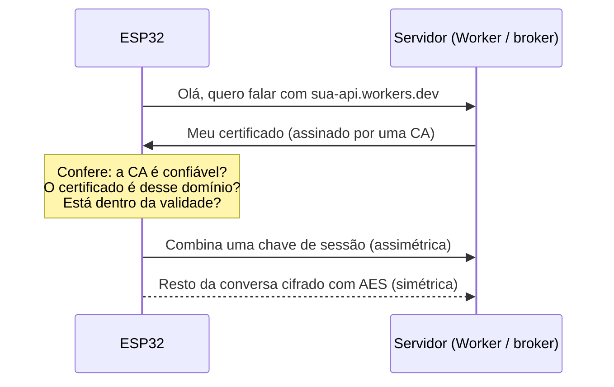
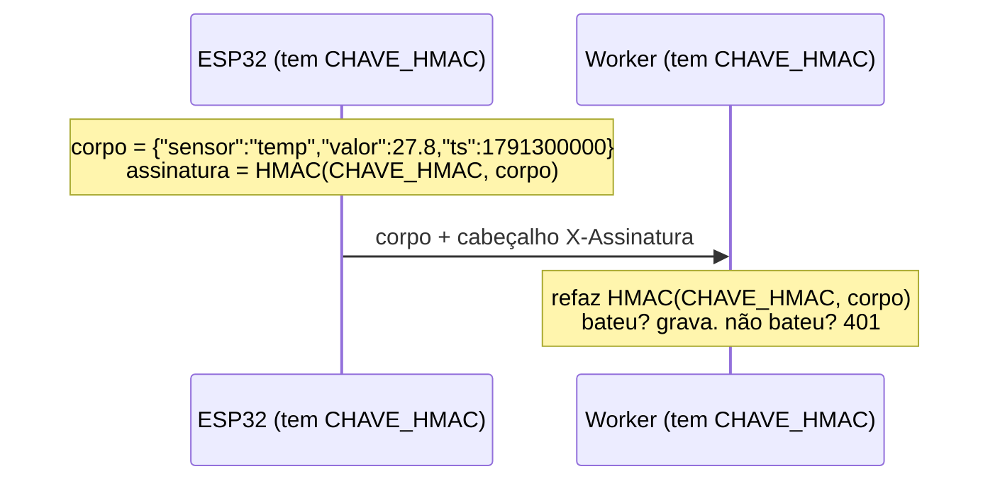
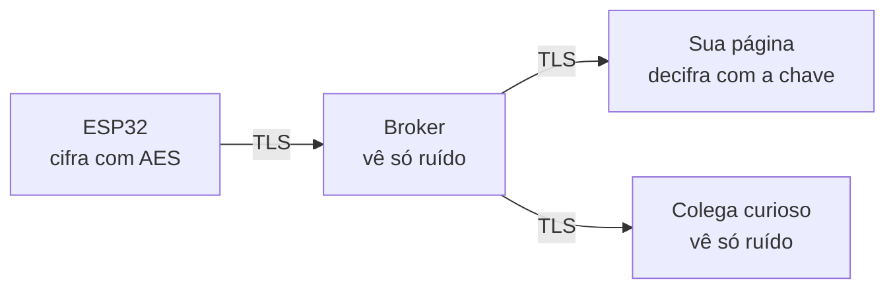

# Atividade IoT — Estação Cofre (Segurança, Autenticação e Criptografia)

**Disciplina:** Internet das Coisas (IoT) · G0813 · Turma AMF 2026-02 · Prof. Leonam Vieira Hemann
**Plataforma:** ESP32 (Arduino) + Cloudflare Workers + D1 + MQTT (test.mosquitto.org)
**Formato:** individual · **Entrega:** 20/10/2026 (Passos 1 a 8) · Passo 9 entra no checkpoint do Projeto Final

> **Até aqui, tudo funcionava, mas nada estava trancado.** O MQTT ia em texto puro pela porta 1883,
> a página usava `ws://` sem criptografia, o ESP32 chamava `client.setInsecure()`, o Worker gravava
> qualquer coisa que chegasse no `/insert` e **qualquer colega podia mandar comando pro seu LED**.
> Hoje vocês não começam um projeto novo: **trancam a estação que já existe, uma camada por vez**,
> e a cada camada **atacam o próprio sistema** pra provar que a tranca funciona.

Este documento tem duas partes. A **Parte 1, Entenda** explica os conceitos (é o conteúdo da aula).
A **Parte 2, Construa** é o passo a passo. Leia a Parte 1 antes de pôr a mão na massa.

**Sumário**
- [Parte 1 — Entenda](#parte-1--entenda)
  - [1. Por que isso importa](#1-por-que-isso-importa)
  - [2. Os quatro pilares da segurança](#2-os-quatro-pilares-da-segurança)
  - [3. Os cinco buracos do nosso projeto](#3-os-cinco-buracos-do-nosso-projeto)
  - [4. Criptografia em cinco ideias](#4-criptografia-em-cinco-ideias)
  - [5. Camada 1 — TLS: o canal cifrado](#5-camada-1--tls-o-canal-cifrado)
  - [6. Camada 2 — API key: "você tem a chave?"](#6-camada-2--api-key-você-tem-a-chave)
  - [7. Camada 3 — Assinatura HMAC: "foi você mesmo, e ninguém mexeu?"](#7-camada-3--assinatura-hmac-foi-você-mesmo-e-ninguém-mexeu)
  - [8. Replay: o ataque de quem não sabe a chave](#8-replay-o-ataque-de-quem-não-sabe-a-chave)
  - [9. Camada 4 — Ponta a ponta com AES-GCM](#9-camada-4--ponta-a-ponta-com-aes-gcm)
  - [10. Onde guardar segredo (e onde nunca guardar)](#10-onde-guardar-segredo-e-onde-nunca-guardar)
  - [11. Resumo: ameaça × camada](#11-resumo-ameaça--camada)
- [Parte 2 — Construa](#parte-2--construa)
- [Arquivos da atividade](#arquivos-da-atividade)
- [Quando der erro](#quando-der-erro)
- [Entrega, critérios e perguntas](#entrega-critérios-e-perguntas)

---

# Parte 1 — Entenda

## 1. Por que isso importa

Dispositivo IoT é o alvo preferido de quem ataca. São bilhões de aparelhos, a maioria nunca é
atualizada depois de instalada, e muitos ficam ligados direto na internet.

- **Botnet Mirai (2016):** câmeras e roteadores domésticos com **senha de fábrica nunca trocada**
  foram sequestrados aos milhares e usados para derrubar grandes sites nos EUA. Não teve ataque
  sofisticado, foi só uma senha padrão.
- **O termômetro do aquário (2017):** um cassino teve dados de clientes roubados por um
  **sensor de temperatura de aquário** conectado à rede. O sensor era a porta mais fraca, e foi
  por ela que entraram.

A lição: **o sensor mais simples é exatamente o tamanho da estação de vocês.** Se ele não for
protegido, ele vira a porta de entrada.

## 2. Os quatro pilares da segurança

Quando alguém diz "isso é seguro", tem que perguntar: **seguro contra o quê?** Os quatro pilares:

| Pilar | Pergunta | Exemplo na nossa estação |
|---|---|---|
| **Confidencialidade** | Quem não deveria ler, consegue ler? | Um colega lê sua temperatura no `sis1a/#` |
| **Integridade** | Alguém pode alterar no caminho sem ninguém perceber? | `27.8` chega no banco como `45.0` |
| **Autenticidade** | Dá pra ter certeza de quem mandou? | Alguém grava leitura falsa no seu Worker |
| **Disponibilidade** | O sistema continua funcionando? | Alguém lota seu banco de lixo |

Cada técnica de hoje cobre um pedaço. **Nenhuma cobre tudo sozinha**, e é por isso que a gente
empilha camadas.

## 3. Os cinco buracos do nosso projeto

Olhem o código que vocês já entregaram e procurem cada um destes:

| # | Buraco | Onde está | O que um atacante faz |
|---|---|---|---|
| 1 | MQTT sem TLS (`1883`, `ws://...:8080`) | ESP32 e página da atividade de MQTT | Lê tudo que passa na rede (Wi-Fi da faculdade, por exemplo) |
| 2 | `client.setInsecure()` | ESP32 (HTTPS pro Worker) | Se passa pelo servidor (*man-in-the-middle*) e lê ou altera tudo |
| 3 | `/insert` aceita qualquer um | Worker (D1/KV) | Grava leitura falsa no seu banco com um comando de PowerShell |
| 4 | `sis1a/<nome>/comando` aberto | ESP32 | **Liga e desliga o seu LED** (ou o relé do seu projeto) |
| 5 | Segredos em lugar errado | `config.h` no GitHub, print do Serial | Copia sua senha e entra como se fosse você |

> **Teste rápido:** o buraco 4 é real **agora**. Qualquer colega que publicar `led:ON` no seu
> tópico de comando acende o seu LED. Na Parte 2 vocês vão fazer isso com o próprio sistema antes
> de fechar a porta.

## 4. Criptografia em cinco ideias

**1. Hash: a impressão digital.** Transforma qualquer coisa num resumo de tamanho fixo. Não dá
pra voltar do resumo pro original, e **mudar 1 caractere muda o resumo inteiro**:

```
SHA-256("27.8") = bd3837a48875e65f17d7771a484284492c4c1a757b29378b9ce28d14b4330c13
SHA-256("27.9") = a4e9fe51e0357c83272b5407b13c67da40e1772eda503c9f704198791d21bed1
```

É por isso que senha se guarda como hash, nunca em texto puro.

**2. Criptografia simétrica: um cadeado, uma chave.** A **mesma chave** tranca e destranca.
É rápida e é a que roda no ESP32 (**AES**). O problema: as duas pontas precisam ter a chave,
e ela precisa chegar lá sem ninguém ver.

**3. Criptografia assimétrica: o cadeado aberto.** Um **par** de chaves. A **pública** pode ir
pra qualquer um (como um cadeado aberto que você distribui). A **privada** só você tem (a única
chave que abre aquele cadeado). É lenta, mas resolve o problema da ideia 2: dá pra combinar
uma chave simétrica com alguém **sem nunca ter se encontrado**.

**4. HMAC: hash com segredo.** É um hash que só quem tem a chave consegue calcular. Funciona
como uma **assinatura**: se a mensagem mudar, ou se quem assinou não tiver a chave, a conta não fecha.

```
HMAC(chave, '{"sensor":"temp","valor":27.8}') = 7e664fe42cdb92e0b3e6...
HMAC(chave, '{"sensor":"temp","valor":45.0}') = 95717b7dca2c03f64ccc...   ← sem a chave, impossível calcular
```

**5. Nonce / IV: nunca repetir.** Um número que **só pode ser usado uma vez**. Cifrar a mesma
coisa duas vezes com a mesma chave e o mesmo IV entrega pistas pro atacante. No nosso código
o IV é sorteado a cada mensagem (`esp_random()`).

> **Regra de ouro:** ninguém inventa criptografia. A gente usa algoritmo conhecido (AES, SHA-256)
> por meio de biblioteca testada (no ESP32, a **mbedtls**, que já vem no core; no navegador e no
> Worker, a **WebCrypto**).

## 5. Camada 1 — TLS: o canal cifrado

O **TLS** (o "S" do HTTPS, o "s" do `wss://`) junta as ideias 2 e 3:


```mermaid
sequenceDiagram
  participant E as ESP32
  participant S as Servidor (Worker / broker)
  E->>S: Olá, quero falar com sua-api.workers.dev
  S->>E: Meu certificado (assinado por uma CA)
  Note over E: Confere: a CA é confiável?<br/>O certificado é desse domínio?<br/>Está dentro da validade?
  E->>S: Combina uma chave de sessão (assimétrica)
  E-->>S: Resto da conversa cifrado com AES (simétrica)
```

O **certificado** é a carteira de identidade do servidor, e a **CA** (autoridade certificadora) é
quem emitiu essa identidade. O ESP32 só confia se conseguir conferir a assinatura da CA, e pra
isso ele **precisa ter o certificado da CA guardado**.

```cpp
client.setInsecure();        // o que fizemos até agora: aceita QUALQUER certificado
client.setCACert(CA_WORKER); // o certo: só aceita certificado assinado por essa CA
```

Com `setInsecure()` o canal até é cifrado, mas **o ESP32 não sabe com quem está falando**.
Um atacante na mesma rede se apresenta como "o servidor", e o ESP32 conversa com ele todo feliz.

**O que o TLS não resolve:** ele protege o **caminho**. Quem está **nas pontas** (o broker, o
Worker) lê tudo em claro, e o TLS não impede ninguém de **mandar** mensagem pro seu Worker.
Pra isso servem as próximas camadas.

## 6. Camada 2 — API key: "você tem a chave?"

A forma mais simples de autenticar: um **segredo compartilhado**, enviado em todo pedido.

```
ESP32 → POST /insert   cabeçalho  X-API-Key: 3f9a...
Worker → confere ANTES de tocar no banco → errado? 401 e não grava nada
```

Já corta 99% dos curiosos. Mas tem um problema sério: **a chave viaja em toda requisição**.
Se ela vazar uma única vez (print do Serial, `config.h` no GitHub, log de algum proxy),
**o atacante tem acesso para sempre**, até vocês trocarem a chave.

## 7. Camada 3 — Assinatura HMAC: "foi você mesmo, e ninguém mexeu?"

Em vez de mandar o segredo, o ESP32 manda uma **assinatura do corpo**, calculada com o segredo.
O Worker refaz a mesma conta e compara:


```mermaid
sequenceDiagram
  participant E as ESP32 (tem CHAVE_HMAC)
  participant W as Worker (tem CHAVE_HMAC)
  Note over E: corpo = {"sensor":"temp","valor":27.8,"ts":1791300000}<br/>assinatura = HMAC(CHAVE_HMAC, corpo)
  E->>W: corpo + cabeçalho X-Assinatura
  Note over W: refaz HMAC(CHAVE_HMAC, corpo)<br/>bateu? grava. não bateu? 401
```

O que isso ganha em relação à API key:
- **O segredo nunca viaja.** Quem captura a requisição vê a assinatura, mas não consegue
  assinar **outra** mensagem com ela.
- **Integridade:** mudou `27.8` pra `45.0`? A assinatura não bate mais.
- **Autenticidade:** só quem tem a chave consegue produzir uma assinatura válida.

**Detalhe que derruba muita gente:** a assinatura vale para os **bytes exatos** do corpo.
`{"valor":27.8}` e `{ "valor": 27.8 }` são corpos diferentes. Por isso o Worker lê o corpo com
`request.text()` (cru) e só depois faz `JSON.parse`.

## 8. Replay: o ataque de quem não sabe a chave

O atacante não consegue forjar assinatura, mas consegue **gravar uma requisição válida e mandar
de novo**, igualzinha. É assim que se abre um portão de garagem com um controle clonado:
o atacante não sabe o código, só repete o sinal que gravou.

A defesa tem duas partes, e o nosso Worker usa as duas:
1. **Carimbo de tempo (`ts`) dentro do corpo assinado.** O Worker recusa tudo com mais de 60 s.
   Como o `ts` está dentro da assinatura, não dá pra trocar o horário sem quebrar a assinatura.
   (Por isso o ESP32 precisa do relógio certo, via NTP.)
2. **Assinatura de uso único.** O Worker guarda as assinaturas aceitas na tabela
   `assinaturas_usadas`. Se a mesma chegar de novo, é replay.

## 9. Camada 4 — Ponta a ponta com AES-GCM

O TLS protege o caminho até o broker, **mas o broker lê tudo**. E num broker público, como o
`test.mosquitto.org`, **qualquer pessoa que assina `sis1a/#` também lê**. A solução é cifrar a
**mensagem**, não só o canal. A isso se chama **criptografia de ponta a ponta**:


```mermaid
flowchart LR
  E["ESP32<br/>cifra com AES"] -- "TLS" --> B["Broker<br/>vê só ruído"]
  B -- "TLS" --> P["Sua página<br/>decifra com a chave"]
  B -- "TLS" --> X["Colega curioso<br/>vê só ruído"]
```

O modo que usamos é o **AES-GCM**, que faz duas coisas de uma vez:
- **cifra** (confidencialidade): sem a chave, `{"temp":27.8}` vira `naRa+1wPTjdx...`
- **lacra** (integridade): junto vai uma *tag* de 16 bytes. Mexeu em **1 bit**, a tag não
  confere e a página recusa abrir.

Cada mensagem leva um **IV novo** (ideia 5), por isso a mesma temperatura nunca gera o mesmo
texto cifrado.

**O problema que sobra é a distribuição da chave.** Como a chave AES chegou na página? Hoje vocês
vão colar à mão. Num produto de verdade, isso é resolvido com criptografia assimétrica (ideia 3)
ou gravando uma chave única em cada dispositivo na fábrica. Guardem essa pergunta.

## 10. Onde guardar segredo (e onde nunca guardar)

| Lugar | Pode? |
|---|---|
| Cloudflare → *Variables and Secrets* → **Secret** | ✅ cifrado, ninguém lê depois de salvo |
| `config.h` **listado no `.gitignore`** | ✅ fica só na sua máquina |
| `config.h` commitado no GitHub | ❌ robôs varrem o GitHub atrás de chaves 24h por dia |
| `Serial.println(API_KEY)` / print da tela com a chave | ❌ vazou |
| A mesma chave em todos os dispositivos | ❌ vazou de um, vazou de todos |
| Certificado de **CA** (`certificados.h`) | ✅ pode publicar: é público, não é segredo |

**Vazou? Troca.** Gerar chave nova custa 10 segundos (`scripts\gerar_chaves.ps1`).

## 11. Resumo: ameaça × camada

| Ameaça | Camada que barra | Onde está no código |
|---|---|---|
| Ler a rede | 1 — TLS | `setCACert()`, porta `8885`, `wss://` |
| Se passar pelo servidor | 1 — TLS com CA conferida | `setCACert()` em vez de `setInsecure()` |
| Gravar dado falso | 2 — API key | `X-API-Key` / `autenticar()` no Worker |
| Alterar dado no caminho | 3 — HMAC | `X-Assinatura` / `hmacHex()` |
| Repetir requisição capturada | 3 — `ts` + assinatura única | tabela `assinaturas_usadas` |
| Ler no broker / nos colegas | 4 — AES-GCM | `cifrarCofre()` / `abrirCofre()` |
| Mandar comando no seu atuador | Bônus — comando assinado | `aoReceber()` no ESP32 |
| Valor absurdo (mesmo autenticado) | Validação de entrada | `LIMITES` no Worker |

---

# Parte 2 — Construa

Pra cada camada: **faz o ataque → liga a tranca → repete o ataque → print do antes e depois.**
Os prints vão no `ENTREGA.md`.

### Passo 0 — Preparar

- **Como:** baixem a pasta da atividade. Vocês vão usar o **Worker e o banco D1 da atividade de D1**
  (o mesmo `DB`) e o ESP32 com DHT11 no **GPIO 4** e LED no **GPIO 2**, como sempre.
- No Arduino IDE, confiram que têm as bibliotecas **PubSubClient** (Nick O'Leary) e
  **DHT sensor library** (Adafruit). A criptografia (mbedtls) **já vem no core do ESP32**.
- **Sem placa?** Tudo funciona no **Wokwi**: Wi-Fi `Wokwi-GUEST` com senha vazia, sensor DHT22
  (troque `DHTTYPE` para `DHT22`), e crie as abas `config.h` e `certificados.h`.
- **PowerShell:** os scripts rodam com
  `powershell -ExecutionPolicy Bypass -File .\nome_do_script.ps1 ...` (de dentro da pasta `scripts`).

### Passo 1 — Seja o atacante (antes de trancar)

- **Como (Worker):** com o Worker **antigo** ainda no ar, rodem:
  ```powershell
  .\ataques.ps1 -Url https://sua-api.SEU-USUARIO.workers.dev -Teste Falso
  ```
- **Confira:** volta `200` e aparece um **999** em `SUA-URL/list?sensor=temp`. Qualquer pessoa
  com a URL faz isso. **Print.**
- **Como (MQTT):** abram `pagina/cofre.html` no navegador, escolham **ws :8080 (sem TLS)**,
  **Conectar**. Na seção 1 aparecem as estações da turma em **vermelho (LEGÍVEL)**.
- **Confira:** vocês conseguem ler a temperatura de colegas que vocês nem sabiam o tópico.
  **Print.**

### Passo 2 — Gerar as chaves

- **Como:** `.\gerar_chaves.ps1`. Ele sorteia três chaves: `API_KEY`, `CHAVE_HMAC` e
  `CHAVE_AES_HEX`.
- Copiem `esp32/estacao_cofre/config.example.h` para **`config.h`** e preencham com Wi-Fi,
  `NOME`, `WORKER_URL` e as três chaves.
- **Confira:** `git status` **não** mostra o `config.h` (o `.gitignore` já cuida). Se mostrar,
  parem e corrijam antes de qualquer commit.

### Passo 3 — Camada 2: Worker novo com API key

- **Como:**
  1. No console do D1, rodem o `worker/schema.sql` (cria `tentativas` e `assinaturas_usadas`;
     não mexe na `leituras` que vocês já têm).
  2. No editor do Worker, colem o `worker/worker.js` e **Deploy**.
  3. Em **Settings → Variables and Secrets**: **Secret** `API_KEY` (valor do Passo 2) e
     **Variable** `EXIGIR_ASSINATURA` = `nao`.
- **Confira:**
  ```powershell
  .\ataques.ps1 -Url SUA-URL -ApiKey SUA_API_KEY -Teste Todos
  ```
  `Falso` e `SemChave` → **401**. `ComChave` → **200**. A camada 2 funciona. **Print.**

### Passo 4 — Camada 1: TLS de verdade no ESP32

- **Como:** gerem os certificados das CAs:
  ```powershell
  .\gerar_certificados.ps1 -Worker sua-api.SEU-USUARIO.workers.dev
  ```
  Ele cria o `esp32/estacao_cofre/certificados.h` com a CA do **seu Worker** e a CA do
  **test.mosquitto.org**. Abram `estacao_cofre.ino` e mandem pra placa.
- **Confira (Serial Monitor):**
  ```
  [NTP] sincronizando relogio... ok (1791300000)
  [MQTT] conectando em test.mosquitto.org:8885 (TLS + login)... ok
  [HTTPS] {"nome":"leonam","sensor":"temp","valor":24.0,"ts":1791300003} -> 200 OK: temp=24
  ```
  Repararam? O MQTT agora vai pela porta **8885**: TLS **e** usuário/senha. **Print.**
- **Prova de que a validação é real:** em `setup()`, troquem temporariamente
  `tlsMqtt.setCACert(CA_MOSQUITTO)` por `tlsMqtt.setCACert(CA_WORKER)` (a CA errada) e mandem
  de novo. O MQTT **tem que falhar** com erro de TLS (`X509 - Certificate verification failed`).
  Isso é o que um *man-in-the-middle* receberia. **Print do erro e voltem ao certo.**

### Passo 5 — O ataque que a API key não segura

- **Como:** com a camada 2 ainda ativa, rodem os testes de assinatura (agora passando a chave HMAC):
  ```powershell
  .\ataques.ps1 -Url SUA-URL -ApiKey SUA_API_KEY -ChaveHmac SUA_CHAVE_HMAC -Teste Todos
  ```
- **Confira:** `Adulterado`, `Replay` (as duas vezes) e `Atrasado` **passam com 200**. Imaginem
  que a API key vazou num print: o atacante grava o que quiser. **Print.**

### Passo 6 — Camada 3: assinatura HMAC + anti-replay

- **Como:** no Worker, **Secret** `CHAVE_HMAC` (do Passo 2) e mudem `EXIGIR_ASSINATURA` para
  `sim`. Não precisa mexer no ESP32: ele **já assina** tudo que manda (`X-Assinatura`).
- **Confira:**
  1. O Serial do ESP32 continua com **200**.
  2. Rodem o **mesmo** comando do Passo 5. Agora: `Valido` → 200, `Adulterado` → **401**,
     `Replay` → 200 e depois **401**, `Atrasado` → **401**.
  3. A seção *Tentativas recusadas* no fim do script mostra cada ataque registrado, com motivo e IP.
  **Print do antes (Passo 5) e depois (este passo).**

### Passo 7 — Camada 4: o cofre (AES-GCM no MQTT)

- **Como:** na `cofre.html`, escolham **wss :8081 (TLS)**, **Conectar**, e colem a sua
  `CHAVE_AES_HEX` em *Meu cofre*.
- **Confira:**
  1. Na seção 1, o seu tópico `sis1a/<nome>/cofre` aparece em **verde (CIFRADO)**: só ruído.
  2. Na seção 2, os valores aparecem **decifrados** (✔ aberto).
  3. Troquem **um caractere** da chave: ✘ não abriu. Peçam pra um colega abrir o **seu** cofre
     com a chave **dele**: também não abre. **Print dos três.**

### Passo 8 — Bônus obrigatório: comandos assinados

- **Como:** em *Comandos assinados*, colem a `CHAVE_HMAC` e cliquem **LED ON / LED OFF**.
- **Confira, nesta ordem (print de cada resposta em "Respostas do ESP32"):**
  1. Assinado → `OK: led:ON` e o LED acende.
  2. Desmarquem **assinar** e mandem → `RECUSADO: sem assinatura`. (No Passo 1 isso funcionava!)
  3. Marquem de novo, mandem, e cliquem **Reenviar o último (replay)** → `RECUSADO: replay`.
  4. Peçam pra um colega mandar comando pro seu tópico com a chave **dele** →
     `RECUSADO: assinatura invalida`.

### Passo 9 — Leve pro seu Projeto Final

O Projeto Final (G2) tem atuador de verdade (relé, servo, bomba) e comando remoto. Um sistema que
**liga um relé** com comando aberto é exatamente o buraco 4. Até o checkpoint de **27/10**
(integração com a nuvem), o projeto de vocês precisa ter **no mínimo**:

1. **TLS validado** (`setCACert`) em toda conexão do ESP32, sem nenhum `setInsecure()` sobrando;
2. **Comando remoto assinado** (o padrão `comando|ts|assinatura` do Passo 8), **ou** a rota do
   Worker que recebe comando protegida com `autenticar()`;
3. **Nenhum segredo no GitHub** (`config.h` no `.gitignore`).

Escrevam no README do projeto, em 3 ou 4 linhas, **qual camada usaram e contra qual ameaça.**
Isso conta na nota de integração com a nuvem do G2.

---

# Arquivos da atividade

```
atividade-iot-seguranca-cripto/
├── README.md                     ← este arquivo
├── ENTREGA.md                    ← preencher e entregar
├── esp32/estacao_cofre/
│   ├── estacao_cofre.ino         ← ESP32: camadas 1 a 4 + comandos assinados
│   ├── config.example.h          ← copiar para config.h (SEGREDOS, não versionar)
│   └── certificados.example.h    ← modelo; o script gera o certificados.h
├── worker/
│   ├── worker.js                 ← Worker com autenticar(), validação e /tentativas
│   └── schema.sql                ← tabelas tentativas e assinaturas_usadas
├── pagina/cofre.html             ← espião + cofre + comandos assinados
└── scripts/
    ├── gerar_chaves.ps1          ← sorteia API_KEY, CHAVE_HMAC e CHAVE_AES_HEX
    ├── gerar_certificados.ps1    ← cria o certificados.h
    └── ataques.ps1               ← ataca o seu Worker (Falso, Adulterado, Replay...)
```

Trechos-chave, para entender o que cada camada faz no código:

**ESP32: assinando o corpo e mandando pelo HTTPS validado**
```cpp
WiFiClientSecure tls;
tls.setCACert(CA_WORKER);                       // Camada 1
String corpo = "{\"nome\":\"...\",\"sensor\":\"temp\",\"valor\":24.0,\"ts\":1791300003}";
http.addHeader("X-API-Key", API_KEY);           // Camada 2
http.addHeader("X-Assinatura", hmacHex(corpo)); // Camada 3
```

**Worker: a ordem das travas** (tudo antes de tocar no banco)
```javascript
const corpo = await request.text();               // cru: é ele que foi assinado
const barrado = await autenticar(request, env, corpo);
if (barrado) return barrado;                       // 401 + registra em "tentativas"
// 1) API key  2) assinatura  3) ts ≤ 60 s  4) assinatura nunca usada
// depois: JSON.parse + validação de faixa + INSERT com .bind()
```

**ESP32: cifrando para o cofre**
```cpp
mbedtls_gcm_crypt_and_tag(&gcm, MBEDTLS_GCM_ENCRYPT, n, iv, 12, NULL, 0,
                          claro, saida, 16, saida + n);   // cifra + tag de 16 bytes
mqtt.publish(T_COFRE.c_str(), cifrarCofre(claro).c_str()); // {"iv":"...","dados":"..."}
```

---

# Quando der erro

| Sintoma | Causa provável | O que fazer |
|---|---|---|
| `erro TLS: X509 - Certificate verification failed` no HTTPS | `certificados.h` de outro Worker, ou a Cloudflare trocou a CA | Rodar `gerar_certificados.ps1` de novo com a **sua** URL |
| Mesmo erro, e o script mostra uma CA com nome de antivírus | O antivírus do PC "abre" o HTTPS para inspecionar | Rodar o script em outra rede/máquina, ou pegar a CA pelo navegador do celular |
| MQTT `falhou rc=-2` com erro TLS | `CA_MOSQUITTO` errada ou incompleta | Rodar o script de novo; conferir as linhas `BEGIN`/`END` |
| MQTT `falhou rc=4` ou `rc=5` | Usuário/senha do broker | `MQTT_USER "rw"`, `MQTT_PASS "readwrite"`, porta `8885` |
| ESP32 recebe `401 assinatura invalida` | `CHAVE_HMAC` diferente entre `config.h` e o Secret | Colar de novo os dois (cuidado com espaço no fim) |
| ESP32 recebe `401 expirada` | Relógio do ESP32 errado | Ver se o `[NTP] ... ok` aparece; a rede pode bloquear NTP |
| `500 Configure o Secret ...` | Secret com nome diferente | Os nomes são exatamente `API_KEY` e `CHAVE_HMAC` |
| Página: ✘ não abriu | Chave AES diferente da do `config.h` | Conferir os 32 caracteres |
| `a execução de scripts foi desabilitada` | Política do PowerShell | Usar `powershell -ExecutionPolicy Bypass -File ...` |

---

# Entrega, critérios e perguntas

Entreguem no GitHub de cada um: o **`estacao_cofre.ino`** (com as modificações que fizerem), o
**`worker.js`** que está no ar, o **`certificados.h`** gerado e o **`ENTREGA.md`** preenchido com
os prints e as respostas. **Sem o `config.h`.**

## Critérios de avaliação

| Critério | Peso |
|---|---|
| Camada 1: ESP32 com `setCACert()` no HTTPS e no MQTT (8885), com a prova da CA errada falhando | 20% |
| Camadas 2 e 3: Worker recusa sem chave, adulterado, replay e atrasado (prints antes × depois) | 25% |
| Camada 4: cofre cifrado no broker e aberto só com a chave certa | 20% |
| Comandos assinados: aceita o assinado, recusa sem assinatura, replay e chave alheia | 15% |
| `ENTREGA.md`: respostas + nenhum segredo no repositório | 20% |

**Atenção:** `config.h` ou qualquer chave aparecendo no repositório ou nos prints **zera o item
"nenhum segredo"**, porque é exatamente o buraco 5.

## Perguntas para o `ENTREGA.md`

1. No Passo 4 vocês trocaram a CA e a conexão falhou. Por que **falhar** é o comportamento
   correto? O que aconteceria com `setInsecure()` nessa mesma situação?
2. O TLS já cifra o caminho até o broker. Por que, mesmo assim, a temperatura aparecia legível
   para a turma no Passo 1, e por que o AES-GCM resolve isso?
3. Comparem **API key** e **assinatura HMAC**: o que um atacante consegue fazer se capturar
   **uma** requisição de cada tipo?
4. O `ts` vai **dentro** do corpo assinado. O que daria errado se ele fosse num cabeçalho
   separado, fora da assinatura?
5. Por que o Worker faz `request.text()` e assina o texto cru, em vez de fazer `request.json()`
   e montar o JSON de novo pra conferir?
6. As rotas `/list` e `/resumo` continuam abertas. Isso é problema? Para que tipo de dado
   (pensem no Projeto Final de vocês) passaria a ser?
7. A chave AES foi colada à mão na página. Como resolver isso num produto com mil dispositivos
   vendidos? (Pensem na ideia 3 da Parte 1.)
8. No seu Projeto Final, qual é o pior estrago que alguém faria sem as camadas de hoje? Qual
   camada vocês vão levar pra lá, e por quê?

Bom trabalho! 🔒
